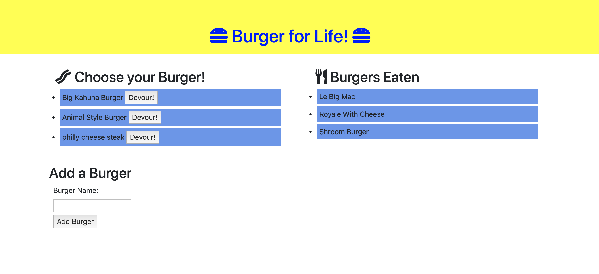

# burger-for-life
Burger for Life! is a restaurant app that lets users put in the names of burgers they'd like to eat as well as create new ones.

## Demonstration:

## Installation: 
- Run `npm install`
- Run `dotevn`
- Run `mysql`
- Run `inquirer`
- Run `express-handlebars`

## Description:

In this assignment, I create a burger logger with MySQL, Node, Express, Handlebars and a homemade ORM (yum!). I also follow the MVC design pattern; use Node and MySQL to query and route data in your app, and Handlebars to generate your HTML.

## Lisence:

MIT

## Create a MVC file structure: 

- 1: Config (connection.js and orm.js)
- 2: Controllers (burger_controller.js)
- 3: db (schema.sql and seeds.sql)
- 4: models (burgers.js)
- 5: node_modules
- 6: Package.json
- 7: public [assets(css and img)]
- 8: server.js
- 9: views (handlerbars)

Once the files are set up, we need to create the connection among them.

## Link to burger-for-life on GitHub:

https://github.com/iamha1/burger-for-life

## Link on Heroku: 
http://peaceful-ravine-27804.herokuapp.com/
│

